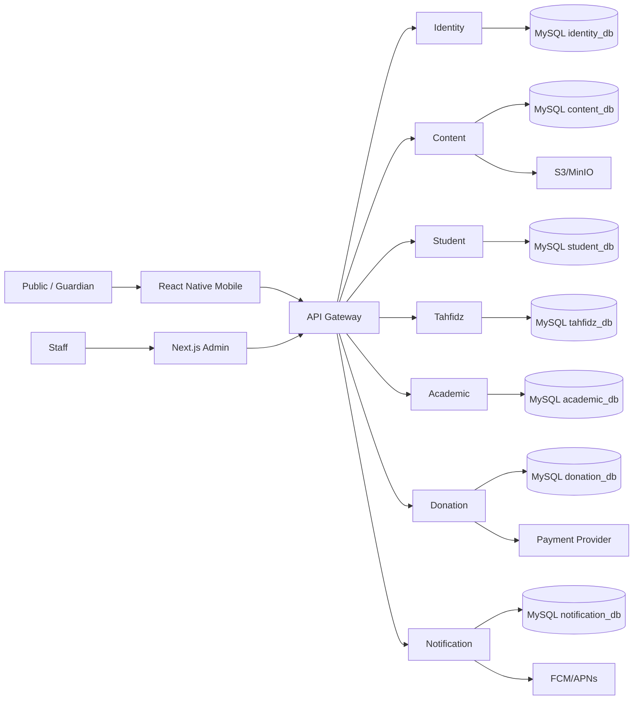

# C4 Context

```mermaid
flowchart LR
  U[Public / Guardian] --> M[React Native Mobile]
  S[Staff] --> A[Next.js Admin]
  M --> G[API Gateway]
  A --> G
  G --> I[Identity]
  G --> C[Content]
  G --> ST[Student]
  G --> T[Tahfidz]
  G --> AC[Academic]
  G --> D[Donation]
  G --> N[Notification]
  I --> IM[(MySQL identity_db)]
  C --> CM[(MySQL content_db)]
  ST --> SM[(MySQL student_db)]
  T --> TM[(MySQL tahfidz_db)]
  AC --> AM[(MySQL academic_db)]
  D --> DM[(MySQL donation_db)]
  N --> NM[(MySQL notification_db)]
  D --> P[Payment Provider]
  N --> F[FCM/APNs]
  C --> O[S3/MinIO]
```
